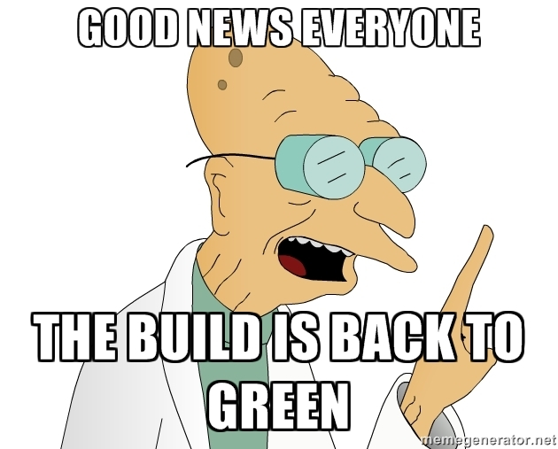
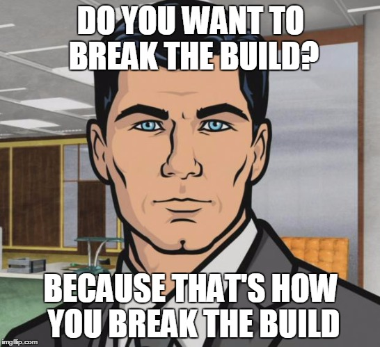
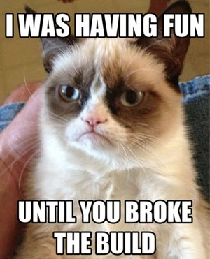
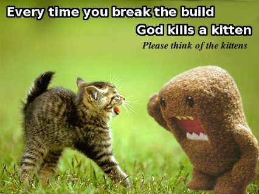

# A collection of memes for build events

Add the links to your .drone.yml configuration for slack blame to use.

```yaml
notify:
  slack_blame:
    success:
      image_attachments:
        - ADD ATTACHMENTS HERE
    failure:
      image_attachments:
        - ADD ATTACHMENTS HERE
```

Pull requests accepted for new images!

## Success



`https://raw.githubusercontent.com/drone-plugins/drone-slack-blame/master/memes/professor_success.jpg`

## Failure



`https://raw.githubusercontent.com/drone-plugins/drone-slack-blame/master/memes/archer_fail.jpg`



`https://raw.githubusercontent.com/drone-plugins/drone-slack-blame/master/memes/grumpy_cat_fail.jpg`



`https://raw.githubusercontent.com/drone-plugins/drone-slack-blame/master/memes/kittens_fail.jpg`
